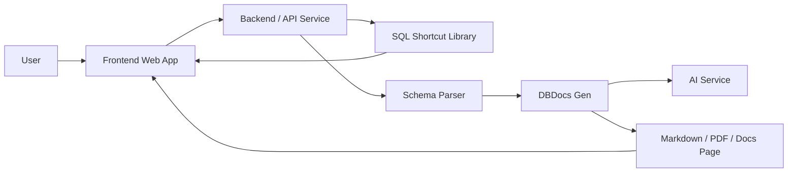

# Architecture

MSF_DB is designed as a modular database productivity toolkit. The main idea is to separate presentation, API orchestration, shortcut metadata, schema parsing, and documentation generation so each part can grow independently.

## High-Level Flow



## Frontend Web App

The frontend is the user-facing layer for:

- SQL Shortcut Explorer
- Filter by database
- Filter by category
- Search shortcut
- Copy query
- Explain query
- Risk label
- Generate documentation from schema

The UI should be optimized for quick lookup and safe usage. Each shortcut card should make it obvious what database it targets, what it does, and how risky it is.

## Backend / API Service

The API service should act as the orchestration layer. It can expose endpoints for:

- Listing shortcuts
- Retrieving shortcut details
- Searching by database or tag
- Parsing schema input
- Generating documentation output
- Returning explanation metadata for a query

## AI Service

The AI service is a support layer, not the source of truth. It should enhance the generated result with natural-language descriptions, table summaries, and relationship explanations.

Expected responsibilities:

- Rewrite technical schema data into readable language
- Assist with table and relationship summaries
- Produce documentation drafts for review
- Keep the generated output safe and explicit

## SQL Shortcut Library

The shortcut library is a structured catalog of reusable SQL snippets. Each record should include metadata so the frontend can render, filter, and explain the shortcut consistently.

Recommended fields:

- `id`
- `title`
- `database`
- `category`
- `risk_level`
- `description`
- `query`
- `explanation`
- `tags`

## Schema Parser

The schema parser is responsible for reading input and extracting useful structure.

It should detect:

- tables
- columns
- data types
- primary keys
- foreign keys
- relationships
- optional comments and defaults

The parser output becomes the structured input for DBDocs Gen.

## Documentation Generator

DBDocs Gen turns schema data into usable documentation.

Input sources:

- SQL DDL
- schema metadata
- ERD data
- database exports

Output targets:

- Markdown
- PDF-ready content
- table dictionaries
- relationship summaries
- documentation pages

## Repository Shape

The target monorepo layout is:

```text
apps/
packages/
docs/
examples/
```

Legacy folders stay available during migration, but new work should move toward the modular structure above.
