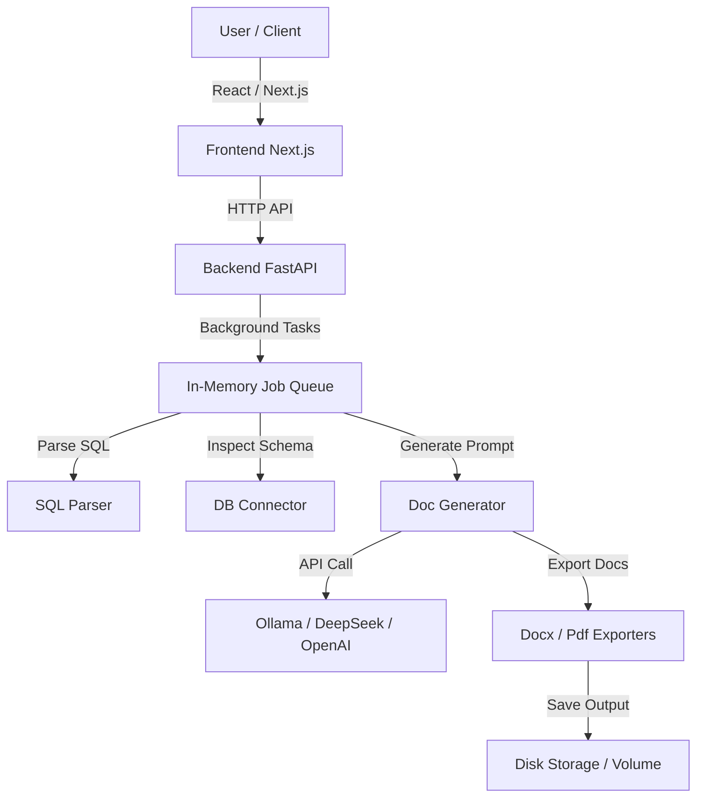

# Arsitektur MSF-DB

## Overview
MSF-DB adalah platform dokumentasi database otomatis yang menggunakan kecerdasan buatan (AI) baik secara lokal (Ollama) maupun cloud (DeepSeek, OpenAI) untuk mengubah skema SQL DDL atau koneksi database langsung menjadi dokumen teknis Markdown, Microsoft Word (.docx), dan PDF.

## Keputusan Arsitektur Utama

### 1. In-Memory Job Queue vs Redis/Celery
* **Keputusan:** Menggunakan dictionary Python in-memory sebagai antrean tugas background.
* **Alasan:** MSF-DB dirancang sebagai personal developer tool atau aplikasi server lokal yang beroperasi pada satu host dengan konkurensi rendah. Setup Redis/Celery menambah beban konfigurasi dan dependensi yang tidak diperlukan untuk deployment skala kecil/lokal.
* **Trade-off:** Antrean tugas tidak bersifat persistent. Jika kontainer backend atau server restart, semua tugas yang sedang berjalan atau mengantre akan hilang.
* **Migrasi Masa Depan:** Jika dibutuhkan skalabilitas tinggi di masa depan, class `JobQueue` dapat di-refactor menggunakan Redis/Celery tanpa perlu mengubah route controller utama karena interaksinya sudah terisolasi di level service interface.

### 2. Ollama Sebagai Native Process di Host
* **Keputusan:** Kontainer Docker untuk Ollama tidak diaktifkan secara default di `docker-compose.yml`, melainkan menggunakan instalasi native Ollama di mesin host (Windows/Linux/Mac).
* **Alasan:** Inferensi AI membutuhkan akselerasi GPU (CUDA/ROC/Metal). Melakukan GPU passthrough ke dalam Docker container di Windows (melalui WSL2) sering kali memerlukan setup driver yang kompleks dan rentan terhadap kendala stabilitas. Mengakses Ollama host melalui `http://host.docker.internal:11434` jauh lebih andal dan mudah disetup.
* **Trade-off:** Pengguna harus mengunduh dan menjalankan Ollama secara manual di komputer mereka sebelum menggunakan model AI lokal.

### 3. Best-Effort SQL Parsing (Regex-Based)
* **Keputusan:** Parser SQL DDL dikembangkan secara internal menggunakan ekspresi reguler (Regex) dengan prinsip *best-effort*, bukan menggunakan AST parser lengkap seperti `sqlglot` atau ANTLR.
* **Alasan:** Tujuan utama parsing DDL di MSF-DB hanyalah mengekstrak informasi dasar (nama tabel, nama kolom, tipe data dasar, dan relasi kunci asing) untuk disusun menjadi tabel ringkasan sebelum dikirim ke AI. AI kemudian akan menginterpretasikan dan mendokumentasikan skema tersebut secara kontekstual. Regex parser lokal sangat ringan, cepat, dan mudah disesuaikan tanpa dependensi pihak ketiga yang besar.
* **Trade-off:** Beberapa syntax DDL yang sangat kompleks atau dialek non-standar mungkin tidak terurai secara sempurna, tetapi sistem memiliki mekanisme fallback di mana tabel kosong tetap akan dikirim ke AI agar didokumentasikan sebaik mungkin.

### 4. File Output ke Disk
* **Keputusan:** Hasil ekspor dokumen (.docx dan .pdf) disimpan sementara di dalam penyimpanan disk dan di-stream ke pengguna saat diminta, bukan disimpan langsung di memori (RAM) sebagai buffer biner.
* **Alasan:** Dokumen hasil generasi bisa berukuran besar (terutama dokumen PDF yang berisi diagram atau skema database besar). Menyimpan buffer biner di memori untuk banyak pengguna secara bersamaan berisiko memicu *Out of Memory* (OOM). File di disk akan dibersihkan secara berkala oleh background worker setelah 60 menit.
